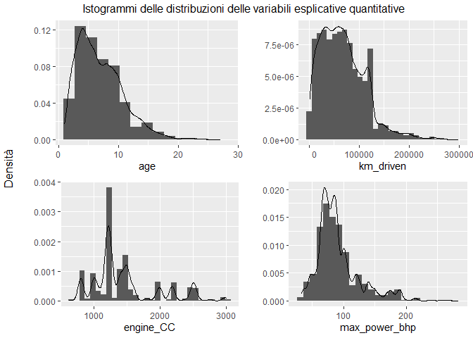
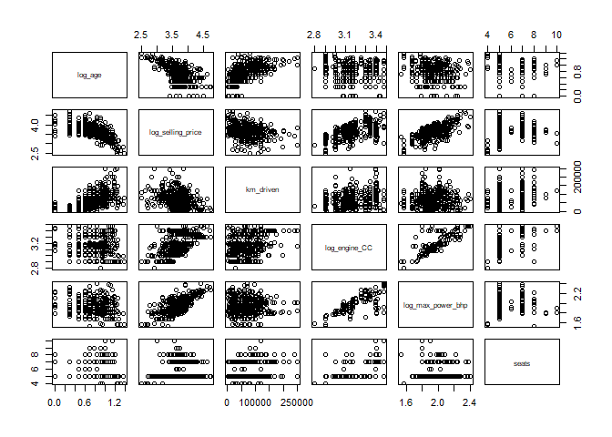
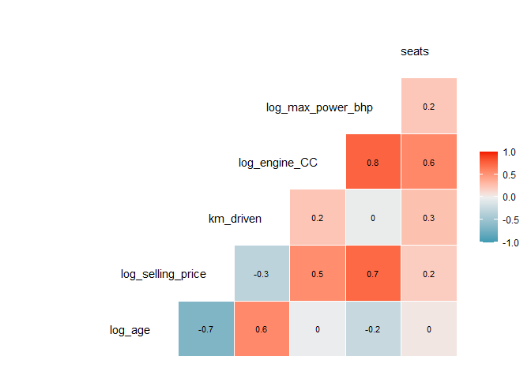

Probability and statistics project: dataset prezzi auto usate
================
Carbone Giorgio, Scuri Gianluca, Gazzola Michele
09/01/2021

# Importazione librerie

# Lettura Dataset

-   Vengono assegnati i fase di lettura i tipi corretti ad ogni
    variabile
-   Alcune variabili presentano l’unità di misura espressa nel valore,
    vengono quindi temporaneamente definiti come stringhe

``` r
data_path <- "https://raw.githubusercontent.com/giocoal/datasets/main/Car%20details%20v3.csv"
car <- read_csv(data_path, col_types = 'ciiiffff????i')
head(data.frame(car))
```

    ##                            name year selling_price km_driven   fuel seller_type
    ## 1        Maruti Swift Dzire VDI 2014        450000    145500 Diesel  Individual
    ## 2  Skoda Rapid 1.5 TDI Ambition 2014        370000    120000 Diesel  Individual
    ## 3      Honda City 2017-2020 EXi 2006        158000    140000 Petrol  Individual
    ## 4     Hyundai i20 Sportz Diesel 2010        225000    127000 Diesel  Individual
    ## 5        Maruti Swift VXI BSIII 2007        130000    120000 Petrol  Individual
    ## 6 Hyundai Xcent 1.2 VTVT E Plus 2017        440000     45000 Petrol  Individual
    ##   transmission        owner    mileage  engine  max_power
    ## 1       Manual  First Owner  23.4 kmpl 1248 CC     74 bhp
    ## 2       Manual Second Owner 21.14 kmpl 1498 CC 103.52 bhp
    ## 3       Manual  Third Owner  17.7 kmpl 1497 CC     78 bhp
    ## 4       Manual  First Owner  23.0 kmpl 1396 CC     90 bhp
    ## 5       Manual  First Owner  16.1 kmpl 1298 CC   88.2 bhp
    ## 6       Manual  First Owner 20.14 kmpl 1197 CC  81.86 bhp
    ##                     torque seats
    ## 1           190Nm@ 2000rpm     5
    ## 2      250Nm@ 1500-2500rpm     5
    ## 3    12.7@ 2,700(kgm@ rpm)     5
    ## 4 22.4 kgm at 1750-2750rpm     5
    ## 5    11.5@ 4,500(kgm@ rpm)     5
    ## 6        113.75nm@ 4000rpm     5

# Obiettivo

L’obiettivo di analisi consiste nella definizione di un modello di
regressione lineare multipla che permetta di predire il prezzo di
vendita di un’automobile usata, quindi la variabile target sarà
`selling_price`.

# Preparazione e pulizia del dataset

#### Scegliamo di non considerare i seguenti attributi

-   Scegliamo di non considerare la colonna mileage perché i consumi
    delle auto con diverso combustibile non sono comparabili, infatti i
    combustibili hanno un diverso rapporto energia generata per unità di
    volume
-   L’attributo torque, in quanto calcolato a rpm diversi per ogni
    veicolo/marca, lo escludiamo dall’analisi

``` r
car <- dplyr::select(car, -c(torque,mileage))
head(car)
```

    ## # A tibble: 6 x 11
    ##   name         year selling_price km_driven fuel  seller_type transmission owner
    ##   <chr>       <int>         <int>     <int> <fct> <fct>       <fct>        <fct>
    ## 1 Maruti Swi~  2014        450000    145500 Dies~ Individual  Manual       Firs~
    ## 2 Skoda Rapi~  2014        370000    120000 Dies~ Individual  Manual       Seco~
    ## 3 Honda City~  2006        158000    140000 Petr~ Individual  Manual       Thir~
    ## 4 Hyundai i2~  2010        225000    127000 Dies~ Individual  Manual       Firs~
    ## 5 Maruti Swi~  2007        130000    120000 Petr~ Individual  Manual       Firs~
    ## 6 Hyundai Xc~  2017        440000     45000 Petr~ Individual  Manual       Firs~
    ## # ... with 3 more variables: engine <chr>, max_power <chr>, seats <int>

#### Conversione unità di misura della variabile selling_price

Conversione dell’unità di misura del prezzo di vendita da centesimi di
dollaro in dollaro

``` r
car$selling_price <- car$selling_price*0.01
```

#### Conversione variabile `year` (anno di produzione) in `age` (anni di vita)

Conversione della variabile `year` (anno di produzione) in `age` (anni
di vita dell’auto nell’anno di vendita, ovvero il 2021)

``` r
car <- add_column(car, age = 2021 - car$year, .after = "year")
car <- dplyr::select(car, -c("year"))
```

#### Introduzione di NA per l’attributo max_power

L’attributo max_power presenta dei missing value in cui però la cella
non è vuota ma presenta la sola unità di misura ‘bhp’

``` r
car$max_power[car$max_power == 0 | car$max_power == "bhp"] <- NA
```

#### Verifico che le unità di misura di ogni singolo attributo siano consistenti tra loro

``` r
all(grepl("CC", car$engine) == !is.na(car$engine))
```

    ## [1] TRUE

``` r
all((grepl("bhp", car$max_power)) == !is.na(car$max_power))
```

    ## [1] TRUE

Entrambi risultano TRUE, questo significa che le unità di misura sono
consistenti per tutte le osservazioni dei due attributi.

#### Conversione degli attributi in cui i valori sono stringhe contenenti i valori accompagnati dall’unità di misura in valori numerici privi di unità di misura

-   A tale scopo utilizziamo la funzione `parse_value` di `dplyr`

-   Elimino gli attributi contenenti i valori accoppiati alle unità di
    misura con la funzione `select()` di `dplyr`

``` r
car['engine_CC'] <- parse_number(car$engine)
car['max_power_bhp'] <- parse_number(car$max_power)
car <- dplyr::select(car, -c('engine', 'max_power'))
```

#### Creazione di una colonna contenente la marca dell’auto

-   Uso la funzione `word` di `dplyr` per estrarre la prima parola del
    nome dell’auto, la quale coincide con la marca dell’auto.

-   Creo la variabile categoriale `make` che indica la marca dell’auto e
    la inserisco nel dataset con la funzione `add_column` della libreria
    `tibble`

``` r
car <- add_column(car, make = factor(word(car$name, 1)), .after = "name")
```

# Statistica descrittiva

## Missing Value

-   Dalla visualizzazione prodotta con l’ausilio della funzione
    `md.pattern` del pacchetto `mice` notiamo come:

    -   una riga presenta un solo missing value

    -   222 righe presentano tre missing value

-   Essendo le righe contenenti `NA` circa il 3% del delle unità
    statistiche, decidiamo di rimuoverle

``` r
md.pattern(car, rotate.names=TRUE)
```

<!-- -->

    ##      name make age selling_price km_driven fuel seller_type transmission owner
    ## 7906    1    1   1             1         1    1           1            1     1
    ## 1       1    1   1             1         1    1           1            1     1
    ## 221     1    1   1             1         1    1           1            1     1
    ##         0    0   0             0         0    0           0            0     0
    ##      seats engine_CC max_power_bhp    
    ## 7906     1         1             1   0
    ## 1        1         1             0   1
    ## 221      0         0             0   3
    ##        221       221           222 664

``` r
car <- car[-which(!complete.cases(car)),]
```

## Outliers

Creiamo un subset del dataset contenente le sole variabili quantitative

``` r
car_nums_colnames <- unlist(lapply(car, is.numeric))
car_num <- car[ , car_nums_colnames]
car_num <- dplyr::select(car_num, -c('seats'))
```

Osserviamo i valori minimi e massimi per ogni attributo quantitativo

``` r
summary(car_num)
```

    ##       age         selling_price      km_driven         engine_CC   
    ##  Min.   : 1.000   Min.   :   300   Min.   :      1   Min.   : 624  
    ##  1st Qu.: 4.000   1st Qu.:  2700   1st Qu.:  35000   1st Qu.:1197  
    ##  Median : 6.000   Median :  4500   Median :  60000   Median :1248  
    ##  Mean   : 7.016   Mean   :  6498   Mean   :  69189   Mean   :1459  
    ##  3rd Qu.: 9.000   3rd Qu.:  6900   3rd Qu.:  95425   3rd Qu.:1582  
    ##  Max.   :27.000   Max.   :100000   Max.   :2360457   Max.   :3604  
    ##  max_power_bhp   
    ##  Min.   : 32.80  
    ##  1st Qu.: 68.05  
    ##  Median : 82.00  
    ##  Mean   : 91.59  
    ##  3rd Qu.:102.00  
    ##  Max.   :400.00

Valuto la presenza di outliers nelle variabili quantitative (e, quando
presenti, delle rispettive variabili con trasformazione logaritmica)
tramite l’osservazione dei *boxplot*.

``` r
par(mfrow=c(2,3))
#summary(car_num)
for (i in names(car_num)) {
  boxplot(car_num[[i]], xlab = i, main = '')
}
par(mfrow=c(1,1))
```

<!-- -->

Tutte le variabili presentano un numero elevato di sospetti outliers. In
particolare, tutte le variabili presentano un certo numero di
osservazioni classificate come potenziali valori anomali perchè si
trovano al di sopra del baffo superiore del boxplot, la cui posizione è
definita come

, dove IQR è il range interquartile. Proviamo a escludere dai potenziali
outlier i *mild outlier* e andiamo invece solo a considerare gli
*extreme outlier*, aumentando il range di osservazioni incluse nei baffi
del boxplot
da![I = \[q\\\_{0.25} - 1.5 \\\\cdot IQR; q\\\_{0.75} + 1.5 \\\\cdot IQR\]](https://latex.codecogs.com/png.image?%5Cdpi%7B110%7D&space;%5Cbg_white&space;I%20%3D%20%5Bq%5C_%7B0.25%7D%20-%201.5%20%5C%5Ccdot%20IQR%3B%20q%5C_%7B0.75%7D%20%2B%201.5%20%5C%5Ccdot%20IQR%5D "I = [q\_{0.25} - 1.5 \\cdot IQR; q\_{0.75} + 1.5 \\cdot IQR]")
a
![I = \[q\\\_{0.25} - 3 \\\\cdot IQR; q\\\_{0.75} + 3 \\\\cdot IQR\]](https://latex.codecogs.com/png.image?%5Cdpi%7B110%7D&space;%5Cbg_white&space;I%20%3D%20%5Bq%5C_%7B0.25%7D%20-%203%20%5C%5Ccdot%20IQR%3B%20q%5C_%7B0.75%7D%20%2B%203%20%5C%5Ccdot%20IQR%5D "I = [q\_{0.25} - 3 \\cdot IQR; q\_{0.75} + 3 \\cdot IQR]")

Inoltre, dato che gli outlier sono solo osservazioni che si trovano al
di sopra del baffo superiore dei boxplot, proviamo ad applicare una
trasformazione logaritmica.

``` r
par(mfrow=c(2,3))
for (i in names(car_num)) {
  boxplot(log10(car_num[[i]]), main = '', xlab = i, range = 3)
}
par(mfrow=c(1,1))
```

<!-- -->

Rimuoviamo alcune unità statistiche (lo 0.6% del dataset) contenenti
valori anomali particolarmente distanti dalle altre osservazioni
disponibili.

``` r
car_num <- car_num[car_num$selling_price < 80000, ]
car_num <- car_num[car_num$engine_CC < 3000, ]
car_num <- car_num[car_num$max_power_bhp < 300, ]
car_num <- car_num[car_num$km_driven < 300000 & car_num$km_driven > 1, ]

car <- car[car$selling_price < 80000, ]
car <- car[car$engine_CC < 3000, ]
car <- car[car$max_power_bhp < 300, ]
car <- car[car$km_driven < 300000 & car$km_driven > 1, ]
```

## Analisi Distribuzionale variabili quantitative

### Fase esplorativa

``` r
summary(car)
```

    ##      name                 make           age         selling_price  
    ##  Length:7865        Maruti  :2362   Min.   : 1.000   Min.   :  300  
    ##  Class :character   Hyundai :1357   1st Qu.: 4.000   1st Qu.: 2700  
    ##  Mode  :character   Mahindra: 748   Median : 6.000   Median : 4500  
    ##                     Tata    : 718   Mean   : 7.009   Mean   : 6454  
    ##                     Honda   : 466   3rd Qu.: 9.000   3rd Qu.: 6900  
    ##                     Toyota  : 443   Max.   :27.000   Max.   :72000  
    ##                     (Other) :1771                                   
    ##    km_driven          fuel                seller_type      transmission 
    ##  Min.   :  1000   Diesel:4274   Individual      :6522   Manual   :6837  
    ##  1st Qu.: 35000   Petrol:3506   Dealer          :1107   Automatic:1028  
    ##  Median : 60000   LPG   :  34   Trustmark Dealer: 236                   
    ##  Mean   : 67842   CNG   :  51                                           
    ##  3rd Qu.: 94000                                                         
    ##  Max.   :298000                                                         
    ##                                                                         
    ##                   owner          seats          engine_CC    max_power_bhp   
    ##  First Owner         :5195   Min.   : 2.000   Min.   : 624   Min.   : 32.80  
    ##  Second Owner        :2004   1st Qu.: 5.000   1st Qu.:1197   1st Qu.: 68.05  
    ##  Third Owner         : 503   Median : 5.000   Median :1248   Median : 82.00  
    ##  Fourth & Above Owner: 158   Mean   : 5.412   Mean   :1453   Mean   : 91.28  
    ##  Test Drive Car      :   5   3rd Qu.: 5.000   3rd Qu.:1582   3rd Qu.:102.00  
    ##                              Max.   :14.000   Max.   :2999   Max.   :282.00  
    ## 

-   Il dataset ha 8123 unità statistiche e 13 attributi

### Variabile Target: selling_price

La variabile target `selling_price` è quantitativa continua

#### Indicatori Statistici

``` r
summary(car$selling_price)
```

    ##    Min. 1st Qu.  Median    Mean 3rd Qu.    Max. 
    ##     300    2700    4500    6454    6900   72000

#### Visualizzazioni e analisi della forma della distribuzione

Osserviamo la distribuzione della variabile target `selling_price`
utilizzando come visualizzazione un istogramma. Nel grafico viene
inserita una stima della funzione di densità di probabilità ottenuta con
il metodo *kernel density estimation (KDE).*

``` r
car %>% ggplot()+geom_histogram(aes(selling_price, ..density..), bins = 30, )+geom_density(aes(selling_price))+ggtitle('Istogramma di selling_price (prezzo di vendita auto usate)')+xlab('Selling Price')+ylab('Densità')
```

<!-- -->

Valutiamo la simmetria della distribuzione con l’ausilio dell’*indice di
simmetria di Pearson* e la curtosi con L’*indice di curtosi di Pearson*

``` r
print(paste("Indice di asimmetria della variabile response selling_price:", skew(car$selling_price), sep = " "))
```

    ## [1] "Indice di asimmetria della variabile response selling_price: 4.115476726524"

``` r
print(paste("Indice di curtosi della variabile response selling_price:", kurtosi(car$selling_price), sep = " "))
```

    ## [1] "Indice di curtosi della variabile response selling_price: 19.6842920763489"

La distribuzione presenta una forte asimmetria positiva, con una coda di
destra molto lunga, inoltre essa soffre di un *eccesso di curtosi*
(essendo il valore dell’indice di curtosi maggiore di 3)

Proviamo a visualizzare nuovamente la variabile dopo l’applicazione di
una trasformazione logaritmica.

``` r
car %>% ggplot()+geom_histogram(aes(selling_price, ..density..), bins = 30, )+geom_density(aes(selling_price))+ggtitle('Istogramma del logaritmo di selling_price (prezzo di vendita auto usate)')+xlab('Selling Price')+ylab('Densità')+scale_x_log10()
```

<!-- -->

Valutiamo la simmetria e la curtosi della distribuzione dopo
l’applicazione della trasformazione logaritmica

``` r
print(paste("Indice di asimmetria della variabile response selling_price:", skew(log10(car$selling_price)), sep = " "))
```

    ## [1] "Indice di asimmetria della variabile response selling_price: 0.237515730249508"

``` r
print(paste("Indice di curtosi della variabile response selling_price:", kurtosi(log10(car$selling_price)), sep = " "))
```

    ## [1] "Indice di curtosi della variabile response selling_price: 1.04764088624322"

La variabile target, in seguito alla trasformazione logaritmica, risulta
più simmetrica e non più affetta da eccesso di curtosi, quindi questa
sarà trasformata prima di procedere con la fase di inferenza.

### Analisi distribuzione variabili esplicative quantitative

#### Indicatori statistici

``` r
summary(car_num)
```

    ##       age         selling_price     km_driven        engine_CC   
    ##  Min.   : 1.000   Min.   :  300   Min.   :  1000   Min.   : 624  
    ##  1st Qu.: 4.000   1st Qu.: 2700   1st Qu.: 35000   1st Qu.:1197  
    ##  Median : 6.000   Median : 4500   Median : 60000   Median :1248  
    ##  Mean   : 7.009   Mean   : 6454   Mean   : 67842   Mean   :1453  
    ##  3rd Qu.: 9.000   3rd Qu.: 6900   3rd Qu.: 94000   3rd Qu.:1582  
    ##  Max.   :27.000   Max.   :72000   Max.   :298000   Max.   :2999  
    ##  max_power_bhp   
    ##  Min.   : 32.80  
    ##  1st Qu.: 68.05  
    ##  Median : 82.00  
    ##  Mean   : 91.28  
    ##  3rd Qu.:102.00  
    ##  Max.   :282.00

#### Visualizzazioni e analisi della forma della distribuzioni

In modo analogo a quanto fatto con la variabile target, osserviamo la
distribuzione delle variabili esplicative quantitative `year`,
`km_driven`, `seats`, `engine_CC` e `max_power_bhp`.

``` r
plot1 <- car_num %>% ggplot()+geom_histogram(aes(age, ..density..), bins=15)+geom_density(aes(age))+ylab('')

plot2 <- car_num %>% ggplot()+geom_histogram(aes(km_driven, ..density..), bins=30)+geom_density(aes(km_driven))+scale_x_continuous(labels = function(x) format(x, scientific = F))+ylab('')

plot3 <- car_num %>% ggplot()+geom_histogram(aes(engine_CC, ..density..), bins=30)+geom_density(aes(engine_CC))+ylab('')

plot4 <- car_num %>% ggplot()+geom_histogram(aes(max_power_bhp, ..density..), bins=25)+geom_density(aes(max_power_bhp))+ylab('')

grid.arrange(plot1, plot2, plot3, plot4, ncol = 2,
             top = "Istogrammi delle distribuzioni delle variabili esplicative quantitative",
             left = "Densità"
             )
```

<!-- -->

Calcoliamo l’*indice di asimmetria di Pearson*

``` r
for (i in names(car_num)) {
  if (i == 'selling_price'){
    next
  }
  print(paste("Indice di asimmetria di Pearson di",i,":", skew(car_num[[i]]), sep = " "))
}
```

    ## [1] "Indice di asimmetria di Pearson di age : 1.00015149184678"
    ## [1] "Indice di asimmetria di Pearson di km_driven : 1.042204165088"
    ## [1] "Indice di asimmetria di Pearson di engine_CC : 1.10620570963134"
    ## [1] "Indice di asimmetria di Pearson di max_power_bhp : 1.52523746888433"

Calcoliamo l’*indice di curtosi di Pearson,* al fine di quantificare la
curtosi ovvero lo ‘spessore’ delle code delle distribuzioni

``` r
for (i in names(car_num)) {
  if (i == 'selling_price'){
    next
  }
  print(paste("Indice di curtosi di Pearson di",i,":", kurtosi(car_num[[i]]), sep = " "))
}
```

    ## [1] "Indice di curtosi di Pearson di age : 1.28881820431325"
    ## [1] "Indice di curtosi di Pearson di km_driven : 1.69667387307551"
    ## [1] "Indice di curtosi di Pearson di engine_CC : 0.582744001825472"
    ## [1] "Indice di curtosi di Pearson di max_power_bhp : 2.87234331496979"

Traiamo le seguenti conclusioni riguardo la simmetria delle variabili:

-   age: asimmetria positiva
-   km_driven: asimmetria positiva, coda di destra molto pronunciata
-   engine_CC: asimmetria positiva
-   max_power_bhp: asimmetria positiva pronunciata, curtosi pronunciata
    vicina a una condizione di *eccesso di curtosi*

Valutiamo la forma delle distribuzioni delle variabili esplicative
quantitative dopo l’applicazione di una trasformazione logaritmica.

``` r
for (i in names(car_num)) {
  if (i == 'selling_price'){
    next
  }
  print(paste("Indice di asimmetria di",i,":", skew(log10(car_num[[i]])), sep = " "))
}
```

    ## [1] "Indice di asimmetria di age : -0.379644862234197"
    ## [1] "Indice di asimmetria di km_driven : -1.13241490954508"
    ## [1] "Indice di asimmetria di engine_CC : 0.403402829447861"
    ## [1] "Indice di asimmetria di max_power_bhp : 0.349799938923115"

``` r
for (i in names(car_num)) {
  if (i == 'selling_price'){
    next
  }
  print(paste("Indice di curtosi di Pearson di",i,":", kurtosi(log10(car_num[[i]])), sep = " "))
}
```

    ## [1] "Indice di curtosi di Pearson di age : -0.211711053835219"
    ## [1] "Indice di curtosi di Pearson di km_driven : 1.54926923460324"
    ## [1] "Indice di curtosi di Pearson di engine_CC : -0.187563399832045"
    ## [1] "Indice di curtosi di Pearson di max_power_bhp : 0.485139587536132"

``` r
plot1 <- car_num %>% ggplot()+geom_histogram(aes(age, ..density..), bins=15)+geom_density(aes(age))+ylab('')+scale_x_log10()

plot2 <- car_num %>% ggplot()+geom_histogram(aes(km_driven, ..density..), bins=30)+geom_density(aes(km_driven))+theme(axis.text.x = element_text(angle = 10))+ylab('')+scale_x_log10()

plot3 <- car_num %>% ggplot()+geom_histogram(aes(engine_CC, ..density..), bins=30)+geom_density(aes(engine_CC))+ylab('')+scale_x_log10()

plot4 <- car_num %>% ggplot()+geom_histogram(aes(max_power_bhp, ..density..), bins=30)+geom_density(aes(max_power_bhp))+ylab('')+scale_x_log10()

grid.arrange(plot1, plot2, plot3, plot4, ncol = 2,
             top = "Istogrammi delle distribuzioni delle variabili esplicative quantitative \n dopo l'applicazione della trasformazione logaritmica",
             left = "Densità"
             )
```

<!-- -->

Viene applicata la trasformazione logaritmica a `age`, `engine_CC` e
`max_power_bhp` perché applicando la forma della trasformazione
logaritmica la distribuzione migliora sia dal punto di vista della
simmetria che della curtosi

``` r
car <- add_column(car, log_selling_price = log10(car$selling_price), .after = "selling_price")
car <- add_column(car, log_age = log10(car$age), .after = "age")
car <- add_column(car, log_max_power_bhp = log10(car$max_power_bhp), .after = "max_power_bhp")
car <- add_column(car, log_engine_CC = log10(car$engine_CC), .after = "engine_CC")

car_num <- add_column(car_num, log_selling_price = log10(car_num$selling_price), .after = "selling_price")
car_num <- add_column(car_num, log_age = log10(car_num$age), .after = "age")
car_num <- add_column(car_num, log_max_power_bhp = log10(car_num$max_power_bhp), .after = "max_power_bhp")
car_num <- add_column(car_num, log_engine_CC = log10(car_num$engine_CC), .after = "engine_CC")
```

## Analisi distribuzionale variabili qualitative

### `fuel`: tipo di carburante

``` r
# coef = 3 indica la lunghezza dei baffi come multipli dell'IQR (porto da 1.5 a 4)
car %>% ggplot(aes(fuel, log_selling_price))+geom_boxplot(coef = 3)+geom_jitter(alpha=0.05)+theme(axis.text.x = element_text(angle = 0, hjust = 1))+stat_summary(fun.y=mean, geom="point", shape=20, size=3, color="red", fill="red")
```

    ## Warning: `fun.y` is deprecated. Use `fun` instead.

<!-- -->

Sono presentati i boxplot delle distribuzioni di `selling_price` in
funzione del tipo di `fuel`. Per ogni distribuzione, mediante l’utilizzo
di linee orizzontati sono rappresentati rispettivamente (partendo dal
basso) il primo quartile, la mediana e il terzo quartile. Viene inoltre
aggiunta, sfruttando `stat_summary` la media, rappresentata da un punto
di colore rosso.

Dalle distribuzioni si evince come:

-   in media e in mediana, il prezzo di vendita di una macchina a GPL
    usata risulti essere il minore. Invece, per le auto a Diesel, si ha
    una concentrazione di osservazioni a valori di `selling_price`
    maggiori e un prezzo medio maggiore rispetto a auto con altre
    tipologie di carburante.

Al fine di verificare la presenza di indipendenza in media calcoliamo il
*rapporto di correlazione*

``` r
corRatio(car$log_selling_price, car$fuel)
```

    ## [1] 0.1071556

Il valore ottenuto evidenzia dipendenza in media molto leggera.

Al fine di verificare la presenza di indipendenza in distribuzione
calcoliamo *l’indice di connessione chi-quadrato* tra
`log_selling_price` e `fuel`:

``` r
chisq_price_fuel <- chisq.test(car$log_selling_price, car$fuel, simulate.p.value = TRUE)
chisq_price_fuel$statistic
```

    ## X-squared 
    ##   3880.78

Il valore dell’indice di connessione, maggiore di zero, suggerisce la
presenza di dipendenza in distribuzione.

### Tipo di proprietario: `owner`

``` r
car %>% ggplot(aes(owner, log_selling_price))+geom_boxplot(coef = 3)+geom_jitter(alpha=0.05)+theme(axis.text.x = element_text(angle = 0, hjust = 1))+stat_summary(fun.y=mean, geom="point", shape=20, size=3, color="red", fill="red")+theme(axis.text.x = element_text(angle = 20, hjust = 1))
```

    ## Warning: `fun.y` is deprecated. Use `fun` instead.

<!-- -->

Dalle distribuzioni si evince come:

-   in media e in mediana, il prezzo di vendita di un’automobile usata
    tenda a diminuire all’aumentare del numero di precedenti proprietari
    dell’auto (sembra quindi ci sia una dipendenza in media tra
    `log_selling_price` e `owner`.

Al fine di verificare la presenza di indipendenza in media calcoliamo il
*rapporto di correlazione*

``` r
corRatio(car$log_selling_price, car$owner)
```

    ## [1] 0.1650738

Il valore ottenuto evidenzia una leggera dipendenza in media.

Al fine di verificare la presenza di indipendenza in distribuzione
calcoliamo *l’indice di connessione chi-quadrato* tra
`log_selling_price` e `owner`:

``` r
chisq_price_owner <- chisq.test(car$log_selling_price, car$owner, simulate.p.value = TRUE)
chisq_price_owner$statistic
```

    ## X-squared 
    ##  8301.246

Il valore dell’indice di connessione, maggiore di zero, suggerisce la
presenza di dipendenza in distribuzione.

### Distribuzione delle marche di auto (`make`)

Visualizziamo la distribuzione delle marche di auto usate vendute con
l’ausilio di un grafico a barre, al fine di avere una visualizzazione
più agile escludiamo le marche con frequenza assoluta minore di 90.

``` r
car %>% group_by(make) %>% count() %>% arrange(desc(n)) %>% ggplot() + geom_col(aes(x=n,y=reorder(make,n)), show.legend = F)+
labs(title = 'Distribuzione marche di auto ordinate per frequenza assoluta',
     subtitle = '',
     x= 'Frequenza Assoluta',
     y='make')
```

<!-- -->

Osserviamo invece ora la distribuzione di `selling price` condizionata a
`make` attraverso dei boxplot. Nei boxplot viene inoltre rappresentata
la dispersione dei valori di `selling_price` con lo scopo principale di
evidenziare il numero di auto di una specifica marca presenti nel
dataset.

``` r
car %>% ggplot(aes(reorder(make, selling_price, median), selling_price))+geom_boxplot()+geom_jitter(alpha=0.02)+geom_hline(aes(yintercept=median(selling_price)))+coord_flip()+xlab('make (marche ordinate per prezzo mediano)')+ylab('selling_price')+theme(aspect.ratio=1)+scale_y_log10()
```

<!-- -->

Dalla visualizzazione possiamo dedurre come le auto usate di marche di
lusso non abbiano un mercato particolarmente ampio, mentre le marche di
auto non di lusso, con un prezzo mediano inferiore, vengono vendute
maggiormente.

### Cambio automatico vs cambio manuale: `transmission`

``` r
car %>% ggplot(aes(transmission, log_selling_price))+geom_boxplot(coef = 3)+geom_jitter(alpha=0.05)+theme(axis.text.x = element_text(angle = 0, hjust = 1))+stat_summary(fun.y=mean, geom="point", shape=20, size=3, color="red", fill="red")
```

    ## Warning: `fun.y` is deprecated. Use `fun` instead.

<!-- -->

Dalle distribuzioni si evince come:

-   Il numero di auto usate vendute che presentano cambio manuale sia
    significativamente maggiore di quelle con cambio automatico
-   In media e in mediana, il prezzo di vendita di un’automobile sembra
    essere maggiore per le auto dotate di cambio automatico (sembra ci
    sia una dipendenza in media tra la variabile `selling_price` e
    `transmission`)

Al fine di verificare la presenza di indipendenza in media calcoliamo il
*rapporto di correlazione*

``` r
corRatio(car$log_selling_price, car$transmission)
```

    ## [1] 0.2482836

Il valore ottenuto evidenzia una moderata dipendenza in media.

Al fine di verificare la presenza di indipendenza in distribuzione
calcoliamo *l’indice di connessione chi-quadrati* tra
`log_selling_price` e `transmission`:

``` r
chisq_price_transmission <- chisq.test(car$log_selling_price, car$transmission, simulate.p.value = TRUE)
chisq_price_transmission$statistic
```

    ## X-squared 
    ##  4108.983

Il valore dell’indice di connessione, maggiore di zero, suggerisce la
presenza di dipendenza in distribuzione.

### Tipo di venditore: `seller_type`

``` r
car %>% ggplot(aes(seller_type, log_selling_price))+geom_boxplot(coef = 3)+geom_jitter(alpha=0.05)+theme(axis.text.x = element_text(angle = 0, hjust = 1))+stat_summary(fun.y=mean, geom="point", shape=20, size=3, color="red", fill="red")
```

    ## Warning: `fun.y` is deprecated. Use `fun` instead.

<!-- -->

Dalle distribuzioni si evince come:

-   Il numero di auto usate vendute da privati è maggiore di quelle
    vendute da dealer (venditore) e da trustmark dealer (venditore con
    garanzia).
-   In media e in mediana, il prezzo di vendita di un’automobile sembra
    essere maggiore per le auto dotate di cambio automatico (sembra
    esserci una certa dipendenza in media tra `log_selling_price` e
    `seller_type`)

Al fine di verificare la presenza di indipendenza in media calcoliamo il
*rapporto di correlazione*

``` r
corRatio(car$log_selling_price, car$seller_type)
```

    ## [1] 0.1397027

Il valore ottenuto evidenzia una leggera dipendenza in media.

Al fine di verificare la presenza di indipendenza in distribuzione
calcoliamo *l’indice di connessione chi-quadrati* tra
`log_selling_price` e `seller_type`:

``` r
chisq_price_seller_type <- chisq.test(car$log_selling_price, car$seller_type, simulate.p.value = TRUE)
chisq_price_transmission$statistic
```

    ## X-squared 
    ##  4108.983

Il valore dell’indice di connessione, maggiore di zero, suggerisce la
presenza di dipendenza in distribuzione.

## Analisi delle correlazioni

Visualizzo possibili correlazioni osservando i *pair plots* (diagrammi a
dispersione accoppiati) tra le variabili quantitative. Al fine di
rendere più agile la rappresentazione grafica viene selezionato tramite
*simple random sampling* un campione di 500 unità statistiche del
dataset originale.

``` r
# Aggiorno il vettore delle colonne numeriche di car
car_nums_colnames_log <- c('log_age','log_selling_price','km_driven','log_engine_CC','log_max_power_bhp', 'seats')
# Prendo un campione di osservazioni per rendere più agile la rappresentazione grafica:
leggero <- car[sample(nrow(car), 500), ]
# Matrice dei diagrammi di dispersione: (non serve usare le variabili trasformate perchè la correlazione non cambia)
pairs(leggero[, car_nums_colnames_log])
```

<!-- -->

``` r
cor(car[ ,car_nums_colnames_log])
```

    ##                       log_age log_selling_price   km_driven log_engine_CC
    ## log_age            1.00000000        -0.6694813  0.56751257   -0.02100349
    ## log_selling_price -0.66948132         1.0000000 -0.31150075    0.54870185
    ## km_driven          0.56751257        -0.3115008  1.00000000    0.23711891
    ## log_engine_CC     -0.02100349         0.5487018  0.23711891    1.00000000
    ## log_max_power_bhp -0.24566154         0.7384216 -0.02596891    0.76062932
    ## seats              0.04803083         0.1905116  0.25930086    0.57380354
    ##                   log_max_power_bhp      seats
    ## log_age                 -0.24566154 0.04803083
    ## log_selling_price        0.73842156 0.19051155
    ## km_driven               -0.02596891 0.25930086
    ## log_engine_CC            0.76062932 0.57380354
    ## log_max_power_bhp        1.00000000 0.22577773
    ## seats                    0.22577773 1.00000000

Al fine di evidenziare le correlazioni osservo i *coefficienti di
correlazione di Pearson*

``` r
ggcorr(car[,car_nums_colnames_log], label = TRUE, label_size = 2.9, hjust = 1, layout.exp = 2)
```

<!-- -->

Osservando i *coefficienti di correlazione di Pearson* deduciamo che la
variabile target `log_selling_price` presenza:

-   Debole associazione positiva con la variabile `seats`

-   Debole associazione negativa con la variabile `km_driven`

-   Moderata associazione positiva con la variabile `log_engine_CC`

-   **Forte associazione positiva** con la variabile `log_max_power_bhp`
    (0.7)

-   **Forte associazione negativa** con la variabile `log_age` (-0.7)

Per quanto riguarda le associazioni tra le variabili esplicative, si
evidenziano alcuni problemi collegati a una probabile
**multicollinarità**:

-   `seats` presenta forte associazione positiva con `log_engine_CC`

    -   successivamente escluderemo `seats` dalla stima del modello di
        regressione perché tra le due è la meno correlata con
        `selling_price`

-   `log_max_power_bhp` presenta forte associazione positiva con
    `log_engine_CC`

    -   successivamente escluderemo `log_engine_CC` dalla stima del
        modello di regressione perché tra le due è la meno correlata con
        `selling_price`

-   `km_driven` presenta una moderata associazione con `log_age`

# Statistica inferenziale

## Preparazione

### Analisi righe duplicate

Quantifico il numero di righe duplicate presenti.

``` r
sum(duplicated(car))
```

    ## [1] 1183

Sono presenti 1183 righe che descrivono auto uguali, dello stesso anno,
con gli stessi km e prezzo. La cosa è sospetta ed inoltre queste righe
non possono riferirsi alla stessa auto rivenduta più volte altrimenti
cambierebbe il campo `owner`. Probabilmente per la maggior parte delle
righe è dovuto ad un cattivo inserimento dei dati, per questo decidiamo
di rimuoverle.

``` r
car_noduplicati <- distinct(car)

plot1 <- car %>% ggplot()+geom_histogram(aes(log_selling_price, ..density..), bins = 30, )+geom_density(aes(log_selling_price))+ggtitle('Istogramma con righe duplicate')+xlab('Selling Price (log10)')+ylab('Densità')

plot2 <- car_noduplicati %>% ggplot()+geom_histogram(aes(log_selling_price, ..density..), bins = 30, )+geom_density(aes(log_selling_price))+ggtitle('Istogramma senza righe duplicate')+xlab('Selling Price (log10)')+ylab('Densità')

plot3 <- ggplot(car, aes(sample = log_selling_price)) + stat_qq() + stat_qq_line(col = "red")+ggtitle('Normal Q-Q con righe duplicate')+xlab('Theoretical Quantiles')+ylab('Sample Quantiles')

plot4 <- ggplot(car_noduplicati, aes(sample = log_selling_price)) + stat_qq() + stat_qq_line(col = "red")+ggtitle('Normal Q-Q senza righe duplicate')+xlab('Theoretical Quantiles')+ylab('Sample Quantiles')

grid.arrange(plot1, plot3, plot2, plot4, ncol = 2)
```

<!-- -->

Rimuovendo le righe duplicate si vede anche un miglioramento nella
distribuzione della variabile `log_selling_price`. Anche il Normal Q-Q
Plot è migliorato anche se le code risultano comunque un po’ più spesse
della distribuzione normale.

### Categorie poco rappresentate

Individuo le marche con un numero di conteggi minore di 13, su cui non
potrei fare una corretta statistica inferenziale una volta splittato il
dataset in `train_set` e `test_set`.

``` r
conteggi <- count(car_noduplicati, make, sort = TRUE)
drop<-conteggi[conteggi$n < 13,]
drop
```

    ## # A tibble: 13 x 2
    ##    make           n
    ##    <fct>      <int>
    ##  1 Mitsubishi    11
    ##  2 Jaguar         8
    ##  3 Volvo          8
    ##  4 Ambassador     4
    ##  5 Force          4
    ##  6 Isuzu          4
    ##  7 Daewoo         3
    ##  8 Kia            3
    ##  9 Land           3
    ## 10 MG             3
    ## 11 Ashok          1
    ## 12 Lexus          1
    ## 13 Opel           1

Rimuovo le 54 righe riferite a 13 marche poco rappresentate.

``` r
car_noduplicati_nodrop <- droplevels(car_noduplicati[!(car_noduplicati$make %in% drop$make),])
str(car_noduplicati_nodrop$make)
```

    ##  Factor w/ 18 levels "Audi","BMW","Chevrolet",..: 11 15 7 8 11 8 11 11 17 6 ...

Individuo gli owner con un numero di conteggi minore di 13, su cui non
potrei fare una corretta statistica inferenziale una volta splittato il
dataset in `train_set` e `test_set`.

``` r
conteggi <- count(car_noduplicati, owner, sort = TRUE)
drop<-conteggi[conteggi$n < 13,]
drop
```

    ## # A tibble: 1 x 2
    ##   owner              n
    ##   <fct>          <int>
    ## 1 Test Drive Car     5

``` r
car_noduplicati_nodrop <- droplevels(car_noduplicati_nodrop[!(car_noduplicati_nodrop$owner %in% drop$owner),])
str(car_noduplicati_nodrop$owner)
```

    ##  Factor w/ 4 levels "First Owner",..: 1 2 3 1 1 1 1 2 1 1 ...

Rimuovo le 5 righe riferite a `Test Drive Car` perché poco
rappresentata.

``` r
car_noduplicati_nodrop <- droplevels(car_noduplicati_nodrop[!(car_noduplicati_nodrop$owner %in% drop$owner),])
str(car_noduplicati_nodrop$owner)
```

    ##  Factor w/ 4 levels "First Owner",..: 1 2 3 1 1 1 1 2 1 1 ...

Le altre variabili categoriali presentano tutte una numerosità maggiore
di 13 per ogni livello.

### Dataset con variabili dummy

Creo un nuovo dataset chiamato `car_dummy` al quale aggiungo le
variabili quantitative in forma logaritmica dove necessario. Al dataset
appena creato aggiungo le colonne relative alle variabili categoriche in
formato dummy. Per ogni attributo vengono generate n-1 nuove colonne
dove n è il numero di modalità di quel particolare attributo.

``` r
#subset delle variabili quantitative
car_dummy <- car_noduplicati_nodrop[,car_nums_colnames_log]

# Aggiungo la variabile fattoriale 'transmission' a car dummy e la converto in numerica (0 corrispode a 'automatic'):
car_dummy <- cbind(car_dummy,transmission = car_noduplicati_nodrop$transmission)
levels(car_dummy$transmission)<-c(1,0)
car_dummy$transmission <- as.numeric(levels(car_dummy$transmission))[car_dummy$transmission]

#converto la variabile fattoriale 'make' in dummy e la aggiungo a car_dummy:
dummy_temp <- data.frame(model.matrix( ~make, data = car_noduplicati_nodrop))[,-1]
car_dummy <-cbind(car_dummy,dummy_temp)

#converto la variabile fattoriale 'fuel' in dummy e la aggiungo a car_dummy:
dummy_temp <- data.frame(model.matrix( ~fuel, data = car_noduplicati_nodrop))[,-1]
car_dummy <-cbind(car_dummy,dummy_temp)

#converto la variabile fattoriale 'seller_type' in dummy e la aggiungo a car_dummy:
dummy_temp <- data.frame(model.matrix( ~seller_type, data = car_noduplicati_nodrop))[,-1]
car_dummy <-cbind(car_dummy,dummy_temp)

#converto la variabile fattoriale 'owner' in dummy e la aggiungo a car_dummy:
dummy_temp <- data.frame(model.matrix( ~owner, data = car_noduplicati_nodrop))[,-1]
car_dummy <-cbind(car_dummy,dummy_temp)
```

Con tutti i valori a zero per una classe di attributi si ottiene: `Audi`
per la classe `make`, `First Owner` per la classe `owner`, `Automatic`
per la classe `transmission`, `Diesel` per la classe `fuel`,
`Individual` per la classe `seller_type`.

### Training e Test sets

Divido il nuovo dataset creato al punto precedente in due con rapporto
80 20 così da poter allenare il modello sulla partizione più grande
(`train_set`) e poterlo poi verificare su quello più piccolo
(`test_set`).

``` r
set.seed(100)
train_ind<-sample(1:nrow(car_dummy),0.8*nrow(car_dummy))

train_set <- car_dummy[train_ind,]
test_set <- car_dummy[-train_ind,]
```

Verifico le dimensioni dei due nuovi dataset.

``` r
print(paste("Numero righe train_set:", nrow(train_set), sep = " "))
```

    ## [1] "Numero righe train_set: 5298"

``` r
print(paste("Numero righe test_set: ", nrow(test_set), sep = " "))
```

    ## [1] "Numero righe test_set:  1325"

## Regressione lineare

Per poter eseguire la regressione lineare abbiamo diverse assunzioni da
fare che andremo in seguito a verificare:

-   **Linearità** tra la variabile target e i regressori;

-   **Omoschedasticità**: la varianza dei residui sia omogenea;

-   **Indipendenza** tra le diverse osservazioni;

-   **Normalità** della distribuzione dei residui;

-   Bassa **multicollinearità.**

### Modello con tutti gli attributi

Iniziamo realizzando un modello di regressione sul `train_set` in cui
considero tutte le variabili.

``` r
modello_completo <- lm(log_selling_price ~ ., data=train_set)
summary(modello_completo)
```

    ## 
    ## Call:
    ## lm(formula = log_selling_price ~ ., data = train_set)
    ## 
    ## Residuals:
    ##      Min       1Q   Median       3Q      Max 
    ## -0.79948 -0.06537  0.01217  0.07955  0.43475 
    ## 
    ## Coefficients:
    ##                               Estimate Std. Error t value Pr(>|t|)    
    ## (Intercept)                  2.061e+00  7.849e-02  26.251  < 2e-16 ***
    ## log_age                     -6.510e-01  9.154e-03 -71.116  < 2e-16 ***
    ## km_driven                   -4.113e-07  4.939e-08  -8.329  < 2e-16 ***
    ## log_engine_CC                1.921e-01  3.167e-02   6.068 1.39e-09 ***
    ## log_max_power_bhp            8.608e-01  2.223e-02  38.726  < 2e-16 ***
    ## seats                        3.134e-02  2.635e-03  11.895  < 2e-16 ***
    ## transmission                -1.978e-02  7.156e-03  -2.764 0.005731 ** 
    ## makeBMW                      3.725e-02  3.274e-02   1.138 0.255291    
    ## makeChevrolet               -3.693e-01  2.788e-02 -13.244  < 2e-16 ***
    ## makeDatsun                  -3.623e-01  3.201e-02 -11.319  < 2e-16 ***
    ## makeFiat                    -3.179e-01  3.509e-02  -9.060  < 2e-16 ***
    ## makeFord                    -2.711e-01  2.718e-02  -9.973  < 2e-16 ***
    ## makeHonda                   -2.068e-01  2.701e-02  -7.658 2.23e-14 ***
    ## makeHyundai                 -2.151e-01  2.656e-02  -8.100 6.77e-16 ***
    ## makeJeep                    -1.566e-01  4.135e-02  -3.788 0.000154 ***
    ## makeMahindra                -2.798e-01  2.711e-02 -10.320  < 2e-16 ***
    ## makeMaruti                  -1.993e-01  2.672e-02  -7.462 9.95e-14 ***
    ## makeMercedes.Benz            5.784e-02  3.293e-02   1.756 0.079062 .  
    ## makeNissan                  -2.168e-01  3.013e-02  -7.194 7.15e-13 ***
    ## makeRenault                 -2.289e-01  2.812e-02  -8.140 4.89e-16 ***
    ## makeSkoda                   -2.319e-01  3.163e-02  -7.330 2.64e-13 ***
    ## makeTata                    -4.072e-01  2.686e-02 -15.159  < 2e-16 ***
    ## makeToyota                  -1.180e-01  2.731e-02  -4.320 1.59e-05 ***
    ## makeVolkswagen              -2.486e-01  2.789e-02  -8.913  < 2e-16 ***
    ## fuelPetrol                  -1.283e-01  4.518e-03 -28.388  < 2e-16 ***
    ## fuelLPG                     -8.241e-02  2.359e-02  -3.494 0.000480 ***
    ## fuelCNG                     -1.428e-01  1.905e-02  -7.498 7.55e-14 ***
    ## seller_typeDealer            2.332e-02  5.911e-03   3.946 8.05e-05 ***
    ## seller_typeTrustmark.Dealer  3.784e-02  2.867e-02   1.320 0.187051    
    ## ownerSecond.Owner           -5.000e-02  4.152e-03 -12.042  < 2e-16 ***
    ## ownerThird.Owner            -9.082e-02  6.932e-03 -13.102  < 2e-16 ***
    ## ownerFourth...Above.Owner   -1.405e-01  1.133e-02 -12.400  < 2e-16 ***
    ## ---
    ## Signif. codes:  0 '***' 0.001 '**' 0.01 '*' 0.05 '.' 0.1 ' ' 1
    ## 
    ## Residual standard error: 0.1203 on 5266 degrees of freedom
    ## Multiple R-squared:  0.8595, Adjusted R-squared:  0.8587 
    ## F-statistic:  1039 on 31 and 5266 DF,  p-value: < 2.2e-16

Ciò che risulta è un modello con un valore dell’R quadro aggiustato
elevato `Adjusted R-squared: 0.8587`. Il problema di questo modello però
è che diversi attributi sono poco significativi quindi probabilmente il
valore R alto è dovuto ad un fenomeno di overfitting. Inoltre alcuni
degli attributi presenti sono correlati tra loro e dovremo quindi
procedere a rimuoverli.

Dalla tabella dei coefficienti si può osservare anche che gli attributi
dummy che presentano la significatività maggiore sono quelli
corrispondenti alle modalità più diverse dalla “modalità zero”, quella
che si ottiene con tutte le colonne di una certa classe uguali a zero
(es. BMW e Mercedes sono le auto più simili alla marca Audi).

### Feature selection

Cerchiamo ora di ridurre il numero di attributi necessari per aumentare
l’interpretabilità e tentare di ridurre i problemi presenti. Per prima
cosa andiamo a rimuovere dal dataset gli attributi che presentano
problemi di multicollinearitá, facciamo riferimento alla tabella delle
correlazioni della sezione “Analisi delle correlazioni”. Dalla tabella
si può vedere che l’attributo `log_engine_CC` è molto correlato con
`log_max_power_bhp` e decidiamo dunque di rimuoverlo.

``` r
train_set <- dplyr::select(train_set, -c('log_engine_CC'))
test_set <- dplyr::select(test_set, -c('log_engine_CC'))
```

Dalla tabella delle correlazioni si può inoltre notare come
`log_max_power_bhp` e `log_age` siano i due attributi più correlati con
`log_selling_price` rispettivamente con valore di `0.74` e `0.67`.
Scegliamo quindi `log_max_power_bhp` come primo attributo con cui
costruire il nuovo modello.

``` r
modello_minimo <- lm(log_selling_price ~ log_max_power_bhp, data=train_set)
summary(modello_minimo)
```

    ## 
    ## Call:
    ## lm(formula = log_selling_price ~ log_max_power_bhp, data = train_set)
    ## 
    ## Residuals:
    ##      Min       1Q   Median       3Q      Max 
    ## -0.98749 -0.14961  0.04497  0.17617  0.61698 
    ## 
    ## Coefficients:
    ##                   Estimate Std. Error t value Pr(>|t|)    
    ## (Intercept)        0.66744    0.04499   14.84   <2e-16 ***
    ## log_max_power_bhp  1.52671    0.02342   65.18   <2e-16 ***
    ## ---
    ## Signif. codes:  0 '***' 0.001 '**' 0.01 '*' 0.05 '.' 0.1 ' ' 1
    ## 
    ## Residual standard error: 0.2384 on 5296 degrees of freedom
    ## Multiple R-squared:  0.4451, Adjusted R-squared:  0.445 
    ## F-statistic:  4248 on 1 and 5296 DF,  p-value: < 2.2e-16

Come ci aspettavamo l’attributo `log_max_power_bhp` è molto
significativo per la descrizione del modello con un p-value molto basso
e un R quadro comunque abbastanza elevato `Adjusted R-squared:  0.445`.
Vediamo ora qui di seguito la rappresentazione grafica della retta
trovata.

``` r
ggplot(train_set, aes(x = log_max_power_bhp, y = log_selling_price)) + geom_point() + stat_smooth(formula = y ~ x, method = "lm", col = "red")
```

<!-- -->

Cerchiamo ora di raffinare il modello andando ad includere un numero
maggiore di attributi. Per farlo eseguiamo un processo di forward
selection. Dato il grande numero di attributi presenti sfruttiamo la
funzione stepAIC.

In prima battuta utilizziamo il `modello_minimo` appena realizzato,
settiamo `direction = "both"` e indichiamo come scope il
`modello_completo`.

``` r
summary(modello_stepAIC)
```

    ## 
    ## Call:
    ## lm(formula = log_selling_price ~ log_max_power_bhp + log_age + 
    ##     fuelPetrol + makeTata + makeToyota + makeChevrolet + makeMercedes.Benz + 
    ##     seats + km_driven + ownerThird.Owner + ownerSecond.Owner + 
    ##     ownerFourth...Above.Owner + makeDatsun + makeMahindra + fuelCNG + 
    ##     makeFord + transmission + makeFiat + seller_typeDealer + 
    ##     makeVolkswagen + fuelLPG + makeRenault + makeHyundai + makeSkoda + 
    ##     makeMaruti + makeHonda + makeNissan + makeJeep, data = train_set)
    ## 
    ## Residuals:
    ##      Min       1Q   Median       3Q      Max 
    ## -0.78731 -0.06636  0.01220  0.07871  0.47088 
    ## 
    ## Coefficients:
    ##                             Estimate Std. Error t value Pr(>|t|)    
    ## (Intercept)                2.471e+00  4.152e-02  59.519  < 2e-16 ***
    ## log_max_power_bhp          9.536e-01  1.633e-02  58.406  < 2e-16 ***
    ## log_age                   -6.420e-01  9.056e-03 -70.893  < 2e-16 ***
    ## fuelPetrol                -1.379e-01  4.234e-03 -32.560  < 2e-16 ***
    ## makeTata                  -4.295e-01  1.893e-02 -22.692  < 2e-16 ***
    ## makeToyota                -1.259e-01  1.946e-02  -6.471 1.06e-10 ***
    ## makeChevrolet             -3.973e-01  2.038e-02 -19.497  < 2e-16 ***
    ## makeMercedes.Benz          4.084e-02  2.678e-02   1.525 0.127233    
    ## seats                      3.804e-02  2.384e-03  15.955  < 2e-16 ***
    ## km_driven                 -3.912e-07  4.941e-08  -7.918 2.93e-15 ***
    ## ownerThird.Owner          -9.064e-02  6.956e-03 -13.031  < 2e-16 ***
    ## ownerSecond.Owner         -5.005e-02  4.166e-03 -12.013  < 2e-16 ***
    ## ownerFourth...Above.Owner -1.402e-01  1.137e-02 -12.332  < 2e-16 ***
    ## makeDatsun                -3.884e-01  2.576e-02 -15.079  < 2e-16 ***
    ## makeMahindra              -2.902e-01  1.928e-02 -15.049  < 2e-16 ***
    ## fuelCNG                   -1.427e-01  1.912e-02  -7.466 9.60e-14 ***
    ## makeFord                  -2.909e-01  1.930e-02 -15.074  < 2e-16 ***
    ## transmission              -2.284e-02  7.159e-03  -3.191 0.001428 ** 
    ## makeFiat                  -3.497e-01  2.947e-02 -11.864  < 2e-16 ***
    ## seller_typeDealer          2.265e-02  5.920e-03   3.826 0.000132 ***
    ## makeVolkswagen            -2.731e-01  2.030e-02 -13.450  < 2e-16 ***
    ## fuelLPG                   -8.995e-02  2.363e-02  -3.806 0.000143 ***
    ## makeRenault               -2.608e-01  2.061e-02 -12.653  < 2e-16 ***
    ## makeHyundai               -2.424e-01  1.843e-02 -13.155  < 2e-16 ***
    ## makeSkoda                 -2.515e-01  2.520e-02  -9.977  < 2e-16 ***
    ## makeMaruti                -2.304e-01  1.865e-02 -12.356  < 2e-16 ***
    ## makeHonda                 -2.287e-01  1.905e-02 -12.004  < 2e-16 ***
    ## makeNissan                -2.362e-01  2.333e-02 -10.122  < 2e-16 ***
    ## makeJeep                  -1.813e-01  3.672e-02  -4.937 8.17e-07 ***
    ## ---
    ## Signif. codes:  0 '***' 0.001 '**' 0.01 '*' 0.05 '.' 0.1 ' ' 1
    ## 
    ## Residual standard error: 0.1207 on 5269 degrees of freedom
    ## Multiple R-squared:  0.8585, Adjusted R-squared:  0.8577 
    ## F-statistic:  1141 on 28 and 5269 DF,  p-value: < 2.2e-16

Il processo di stepAIC ha portato all’esclusione di 2 attributi:
`makeBMW` e `seller_typeTrustmark.Dealer`. Questo ha portato il valore
dell’R quadro aggiustato a `Adjusted R-squared:  0.8577`, cioè
praticamente identico a quello iniziale. Togliendo quelle colonne
abbiamo quindi alleggerito il modello senza perdere di performance.

Per ridurre ulteriormente il numero di attributi da cui è composto il
modello è possibile procedere in due modi:

-   selezionare una diversa “modalità nulla” che abbia un maggior numero
    di attributi simili (es. una marca che faccia auto in una fascia di
    prezzo inferiore rispetto ad Audi)

-   ricorrere nuovamente ad utilizzare la funzione stepAIC settando il
    parametro k, che limita la significatività dei parametri, ad un
    valore corrispondente a `0.001`.

Ricorriamo a questa seconda opzione utilizzando la funzione `qchisq` per
calcolare il parametro k.

``` r
summary(modello_stepAIC_k)
```

    ## 
    ## Call:
    ## lm(formula = log_selling_price ~ log_max_power_bhp + log_age + 
    ##     fuelPetrol + makeTata + makeToyota + makeChevrolet + makeMercedes.Benz + 
    ##     seats + makeBMW + km_driven + ownerThird.Owner + ownerSecond.Owner + 
    ##     ownerFourth...Above.Owner + makeDatsun + makeMahindra + fuelCNG + 
    ##     makeFord + transmission + makeFiat + seller_typeDealer + 
    ##     makeVolkswagen + fuelLPG, data = train_set)
    ## 
    ## Residuals:
    ##      Min       1Q   Median       3Q      Max 
    ## -0.78079 -0.06698  0.01109  0.07954  0.47212 
    ## 
    ## Coefficients:
    ##                             Estimate Std. Error t value Pr(>|t|)    
    ## (Intercept)                2.219e+00  3.311e-02  67.019  < 2e-16 ***
    ## log_max_power_bhp          9.670e-01  1.491e-02  64.850  < 2e-16 ***
    ## log_age                   -6.357e-01  9.060e-03 -70.160  < 2e-16 ***
    ## fuelPetrol                -1.398e-01  4.213e-03 -33.191  < 2e-16 ***
    ## makeTata                  -1.957e-01  5.997e-03 -32.628  < 2e-16 ***
    ## makeToyota                 1.044e-01  8.868e-03  11.778  < 2e-16 ***
    ## makeChevrolet             -1.637e-01  9.496e-03 -17.236  < 2e-16 ***
    ## makeMercedes.Benz          2.578e-01  2.281e-02  11.302  < 2e-16 ***
    ## seats                      3.815e-02  2.381e-03  16.024  < 2e-16 ***
    ## makeBMW                    2.325e-01  2.267e-02  10.255  < 2e-16 ***
    ## km_driven                 -4.040e-07  4.968e-08  -8.131 5.24e-16 ***
    ## ownerThird.Owner          -9.042e-02  7.003e-03 -12.911  < 2e-16 ***
    ## ownerSecond.Owner         -5.011e-02  4.194e-03 -11.948  < 2e-16 ***
    ## ownerFourth...Above.Owner -1.386e-01  1.144e-02 -12.118  < 2e-16 ***
    ## makeDatsun                -1.504e-01  1.774e-02  -8.479  < 2e-16 ***
    ## makeMahindra              -5.787e-02  7.284e-03  -7.945 2.36e-15 ***
    ## fuelCNG                   -1.373e-01  1.920e-02  -7.152 9.74e-13 ***
    ## makeFord                  -5.735e-02  7.585e-03  -7.561 4.68e-14 ***
    ## transmission              -3.513e-02  7.022e-03  -5.002 5.85e-07 ***
    ## makeFiat                  -1.160e-01  2.358e-02  -4.917 9.05e-07 ***
    ## seller_typeDealer          2.349e-02  5.950e-03   3.948 7.97e-05 ***
    ## makeVolkswagen            -4.140e-02  1.057e-02  -3.918 9.04e-05 ***
    ## fuelLPG                   -9.038e-02  2.378e-02  -3.801 0.000146 ***
    ## ---
    ## Signif. codes:  0 '***' 0.001 '**' 0.01 '*' 0.05 '.' 0.1 ' ' 1
    ## 
    ## Residual standard error: 0.1216 on 5275 degrees of freedom
    ## Multiple R-squared:  0.8563, Adjusted R-squared:  0.8557 
    ## F-statistic:  1429 on 22 and 5275 DF,  p-value: < 2.2e-16

Risultano quindi esclusi dal modello 8 degli attributi iniziali, il
modello è ora composto da 23 attributi molto significativi. Il valore
dell’R quadro aggiustato è `Adjusted R-squared: 0.8557`, cioè
praticamente identico a quello individuato in precedenza.

### Confronto modelli trovati

Utilizzando ora la funzione `anova` confrontiamo il modello ottenuto con
la funzione stepAIC e quello ottenuto dal processo di stepAIC con
parametro k per vedere se la rimozione degli attributi meno
significativi è giustificata.

``` r
anova(modello_stepAIC_k, modello_stepAIC)
```

    ## Analysis of Variance Table
    ## 
    ## Model 1: log_selling_price ~ log_max_power_bhp + log_age + fuelPetrol + 
    ##     makeTata + makeToyota + makeChevrolet + makeMercedes.Benz + 
    ##     seats + makeBMW + km_driven + ownerThird.Owner + ownerSecond.Owner + 
    ##     ownerFourth...Above.Owner + makeDatsun + makeMahindra + fuelCNG + 
    ##     makeFord + transmission + makeFiat + seller_typeDealer + 
    ##     makeVolkswagen + fuelLPG
    ## Model 2: log_selling_price ~ log_max_power_bhp + log_age + fuelPetrol + 
    ##     makeTata + makeToyota + makeChevrolet + makeMercedes.Benz + 
    ##     seats + km_driven + ownerThird.Owner + ownerSecond.Owner + 
    ##     ownerFourth...Above.Owner + makeDatsun + makeMahindra + fuelCNG + 
    ##     makeFord + transmission + makeFiat + seller_typeDealer + 
    ##     makeVolkswagen + fuelLPG + makeRenault + makeHyundai + makeSkoda + 
    ##     makeMaruti + makeHonda + makeNissan + makeJeep
    ##   Res.Df    RSS Df Sum of Sq      F    Pr(>F)    
    ## 1   5275 77.993                                  
    ## 2   5269 76.807  6    1.1856 13.555 2.513e-15 ***
    ## ---
    ## Signif. codes:  0 '***' 0.001 '**' 0.01 '*' 0.05 '.' 0.1 ' ' 1

La differenza tra il modello ottenuto dalla funzione stepAIC con e senza
il valore k è di 6 gradi di libertà. Andando però a valutare il p-value
complessivo di questi attributi il loro contributo sembra essere molto
significativo. Infatti il valore è di molto inferiore a 0,05 e ci porta
ad affermare che il modello più complesso è significativamente migliore
del modello più semplice, cioè fornisce un adattamento migliore ai dati.

La funzione anova restituisce inoltre il valore di F che corrisponde al
rapporto delle varianze dei due modelli. Le varianze sono una misura
della dispersione delle osservazioni dalla media. La statistica F è un
rapporto di due quantità che dovrebbero essere approssimativamente
uguali nell’ipotesi nulla, che produce una statistica F di circa 1. Nel
nostro caso abbiamo una f-test di 13,8 che ci indica una miglior
varianza del modello con più attributi.

### Analisi residui

In questa sezione andiamo a studiare i residui del `modello_stepAIC`
generando i diagnostic plots.

``` r
plot1 <- qplot(.fitted, .resid, data = modello_stepAIC) + geom_hline(yintercept = 0) + geom_smooth(se = FALSE, col = "red") +ggtitle('Residuals vs Fitted')+ylab('Residuals')+xlab('Fitted values')

plot2 <- qplot(sample =.stdresid, data = modello_stepAIC, stat = "qq") + geom_abline(col = "red")+ggtitle('Normal Q-Q Plot')+ylab('Standardized Residuals')+xlab('Theoretical Quantiles') + geom_text(aes(label = '5491'), x=-3, y=-6.3)

plot3 <- qplot(.fitted, sqrt(abs(.stdresid)), data = modello_stepAIC) + geom_hline(yintercept = 1) + geom_smooth(se = FALSE,col = "red") +ggtitle('Scale - Location')+xlab('Fitted values')+ylab(expression(sqrt(abs('Standardized residuals '))))

plot4 <- qplot(.hat, .stdresid, data = modello_stepAIC) + geom_smooth(se = FALSE,col = "red")+ggtitle('Residuals vs Leverage')+xlab('Leverage')+ylab('Standardized residuals') + geom_hline(yintercept = 0)

grid.arrange(plot1,plot2,plot3,plot4)
```

    ## `geom_smooth()` using method = 'gam' and formula 'y ~ s(x, bs = "cs")'
    ## `geom_smooth()` using method = 'gam' and formula 'y ~ s(x, bs = "cs")'
    ## `geom_smooth()` using method = 'gam' and formula 'y ~ s(x, bs = "cs")'

<!-- -->

Analizziamo separatamente i 4 diversi grafici:

-   Il primo mostra eventuali pattern non lineari nei residui che
    potrebbero suggerire una relazione non lineare tra target e
    regressori. Nel nostro caso risulta come ci si aspettava una retta
    orizzontale.

-   Il secondo verifica se la distribuzione dei residui è Gaussiana. Nel
    nostro caso per valori dei quantili teorici tra -2 e -4 c’è un
    allontanamento dei dati dalla retta, questo mostra un’asimmetria
    della distribuzione che affronteremo qui di seguito.

-   Il terzo verifica l’assunzione dell’omoschedasticità. Nel nostro
    caso si ottiene con buona approssimazione una retta orizzontale che
    verifica l’assunzione.

-   Il quarto permette di trovare eventuali outliers rimasti che
    potrebbero modificare in modo significativo il modello. Dei nostri
    punti nessuno si trova oltre la Cook’s distance.

L’anomalia del Normal Q-Q plot indica una asimmetria della
distribuzione. Questo è probabilmente dovuto alla mancanza di una
variabile nel calcolo del costo di un’auto. Infatti, nonostante il
modello descriva bene i dati, potrebbe essere molto migliore se ci fosse
una variabile riferita allo stato dell’auto; questo infatti è uno dei
parametri che maggiormente può influenzare il costo di un’auto usata. In
particolare presumiamo vengono sovrastimati i prezzi dei veicoli che
presentano buone caratteristiche sulla carta ma che presentano dei
danni.

``` r
car_noduplicati_nodrop[row.names(car_noduplicati_nodrop) == 5491,]
```

    ## # A tibble: 1 x 16
    ##   name        make    age log_age selling_price log_selling_pri~ km_driven fuel 
    ##   <chr>       <fct> <dbl>   <dbl>         <dbl>            <dbl>     <int> <fct>
    ## 1 Volkswagen~ Volk~     1       0          2600             3.41     50000 Dies~
    ## # ... with 8 more variables: seller_type <fct>, transmission <fct>,
    ## #   owner <fct>, seats <int>, engine_CC <dbl>, log_engine_CC <dbl>,
    ## #   max_power_bhp <dbl>, log_max_power_bhp <dbl>

Analizziamo ad esempio l’osservazione 5491 nel qq Plot che è quella che
si discosta maggiormente, corrisponde ad una Volkswagen Polo 1.5 TDI
Comfortline venduta a 2600$. Confrontandola con le altre righe nel
database che corrispondono a questo modello di auto vediamo che hanno
tutte prezzi maggiori nonostante siano più vecchie e con più km, questa
cosa ci fa pensare quindi che si tratti di un’auto incidentata o
seriamente danneggiata.

``` r
car_noduplicati_nodrop[car_noduplicati_nodrop$name == 'Volkswagen Polo 1.5 TDI Comfortline',]
```

    ## # A tibble: 7 x 16
    ##   name        make    age log_age selling_price log_selling_pri~ km_driven fuel 
    ##   <chr>       <fct> <dbl>   <dbl>         <dbl>            <dbl>     <int> <fct>
    ## 1 Volkswagen~ Volk~     7   0.845         3500              3.54     60000 Dies~
    ## 2 Volkswagen~ Volk~     5   0.699         5500              3.74     70000 Dies~
    ## 3 Volkswagen~ Volk~     6   0.778         4160              3.62     80000 Dies~
    ## 4 Volkswagen~ Volk~     2   0.301         6950              3.84     36800 Dies~
    ## 5 Volkswagen~ Volk~     7   0.845         5750              3.76     40000 Dies~
    ## 6 Volkswagen~ Volk~     1   0             2600              3.41     50000 Dies~
    ## 7 Volkswagen~ Volk~     6   0.778         4350.             3.64     50000 Dies~
    ## # ... with 8 more variables: seller_type <fct>, transmission <fct>,
    ## #   owner <fct>, seats <int>, engine_CC <dbl>, log_engine_CC <dbl>,
    ## #   max_power_bhp <dbl>, log_max_power_bhp <dbl>

# Analisi predittiva

In questa sezione andiamo ad analizzare le capacità predittive del
nostro modello applicandolo al `test_set`. In primo luogo andiamo a
controllare il valore dell’R quadro che ci restituisce.

``` r
lm_pred <- predict(modello_stepAIC, newdata = test_set %>% dplyr::select(-log_selling_price))
R2(lm_pred, test_set$log_selling_price)
```

    ## [1] 0.8551857

Il valore di R quadro che si ottiene è praticamente identico a quello
ottenuto sul `train_set` che era di `0.8577`, ciò significa che il
modello è buono e predice bene i risultati.

Valutiamo ora anche il Root Mean Squared Error, cioè la misura di errore
assoluta con le deviazioni elevate al quadrato. Più basso è il valore
dell’RMSE e migliore è il modello rappresentato.

``` r
RMSE(pred = modello_stepAIC$fitted.values, obs = train_set$log_selling_price)  # RMSE of train dataset
```

    ## [1] 0.1204051

``` r
RMSE(pred = lm_pred, obs = test_set$log_selling_price)                         # RMSE of test dataset
```

    ## [1] 0.1205266

Nel nostro caso i valori dell’RMSE calcolati per entrambi i modelli, sia
sul `train_test` che sul `test_set`, sono bassi e risultano praticamente
identici per cui possiamo affermare che il modello è buono e nonostante
l’alto numero di attributi non ha overfittato il `train_set`.
